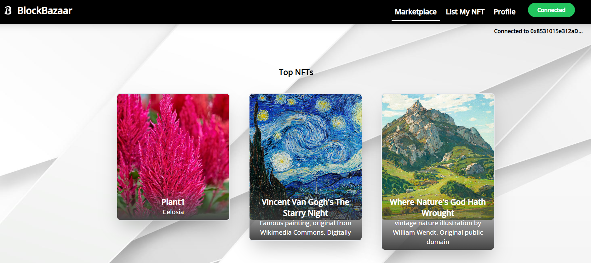

# BlockBazaar

BlockBazaar is a decentralized marketplace where users can buy and sell digital assets as NFTs securely on the Ethereum blockchain. Inspired by e-commerce platforms, it features smart contracts written in Solidity and utilizes Hardhat for testing and deploying these contracts. The platform's React front-end, powered by libraries like ethers.js and web3, ensures seamless interaction with Ethereum, while Pinata facilitates IPFS storage for NFT metadata. Users can manage their digital assets through a profile section, view owned NFTs, and participate in transparent, peer-to-peer transactions without intermediaries. Deployment to the Sepolia test network is simplified with command-line integration, enabling developers to contribute and enhance the platform's capabilities.

## Features

- Decentralized Marketplace: Facilitates peer-to-peer transactions without intermediaries, ensuring transparency and security through blockchain technology.
- Smart Contracts: Implements business logic and escrow services using Solidity, ensuring trustless interactions between buyers and sellers.
- NFT Support: Users can upload their digital assets as NFTs using Pinata for IPFS storage, and sell them on BlockBazaar.
- Profile Section: Users can view their owned NFTs and manage their digital assets.
- React Front-end: Provides an intuitive and familiar user interface similar to traditional e-commerce platforms.
- Testing and Deployment: Uses Hardhat for testing smart contracts locally and deploying them to Ethereum networks.

## Technologies Used

- Solidity: Language for writing smart contracts on Ethereum.
- Hardhat: Development environment for compiling, deploying, and testing smart contracts.
- React: Front-end library for building user interfaces.
- ethers.js: Library for interacting with the Ethereum blockchain and smart contracts.
- web3: Ethereum JavaScript API for integration with decentralized applications.
- Pinata: Service for uploading files to IPFS, used for storing NFT metadata.

## Preview



## Getting Started

To run BlockBazaar locally, follow these steps:

1. Clone the repository:
   ```sh
   git clone https://github.com/your/repository.git
   cd repository-name
   ```

2. Install dependencies:
   ```sh
   npm install
   ```

3. Start the development server:
   ```sh
   npm run start
   ```

   This command starts the React development server.

4. Access BlockBazaar:
   Open your browser and go to `http://localhost:3000` to view and interact with BlockBazaar.

## Deploying Smart Contracts

If you need to deploy the smart contracts to the Sepolia test network after making changes, follow these steps:

1. Deploy smart contracts:
   ```sh
   npx hardhat run ./scripts/deploy.js --network sepolia
   ```

   Make sure to use your own account from the Sepolia test network, which you can create using MetaMask. You can faucet some SepoliaETH from a Google faucet.

## Using Pinata for NFTs

To use Pinata for uploading your digital assets as NFTs and storing metadata on IPFS:

1. Get API Keys: Obtain your API keys from the [Pinata website](https://pinata.cloud/) and the Sepolia test network from [Alchemy](https://www.alchemy.com/).
2. Configure API Keys: Replace the sample API keys in the project with your own.

## Contributing

We welcome contributions to BlockBazaar! To contribute:

1. Fork the repository.
2. Create your feature branch (`git checkout -b feature/AmazingFeature`).
3. Commit your changes (`git commit -m 'Add some AmazingFeature'`).
4. Push to the branch (`git push origin feature/AmazingFeature`).
5. Open a pull request.

Please ensure to update tests as appropriate and follow coding conventions.

## License

This project is licensed under the [MIT License](https://opensource.org/licenses/MIT). See the LICENSE file for more details.

## Acknowledgements

- This project is inspired by the teachings of Aniket Gupta from Alchemy.